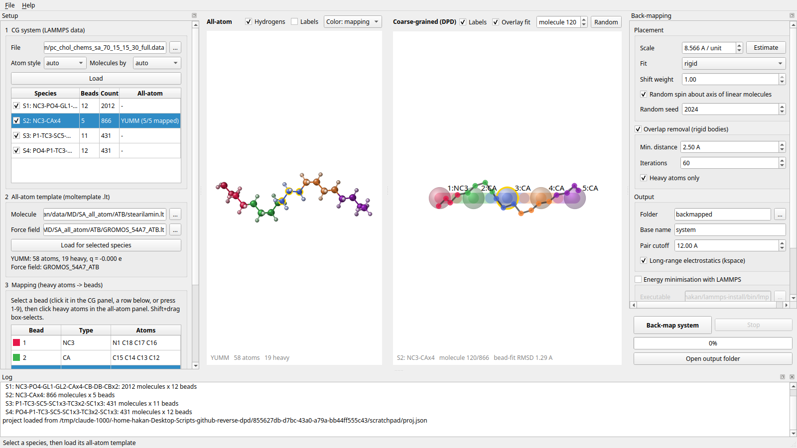

# revdpd — DPD → all-atom back-mapping GUI

**revdpd** takes a coarse-grained **DPD** configuration stored as a LAMMPS data file,
splits it into molecules, lets you define **which all-atom heavy atoms belong to which
CG bead** by clicking in two side-by-side 3D views, and then places an all-atom copy of
every molecule into the system **keeping the orientation of each CG molecule**.
Optionally it removes overlaps and minimises the result with LAMMPS.



## Features

- Reads LAMMPS data files in atom style **`angle`** or **`full`** (also `molecular`,
  `bond`), selectable or auto-detected from the `Atoms # style` comment; type labels,
  image flags and triclinic boxes are handled
  ([LAMMPS `read_data` format](https://docs.lammps.org/read_data.html)).
- Splits the system into molecules (by molecule ID or bond connectivity), makes
  them whole across periodic boundaries and groups identical molecules into species.
- Reads all-atom templates with force field from **moltemplate** `.lt` files, e.g.
  as produced by the [Automated Topology Builder (ATB)](https://atb.uq.edu.au). The
  force-field file (`GROMOS_54A7_ATB.lt` …) is located automatically in the same
  folder or through `import` statements.
- Interactive mapping: pick a bead on the CG side, click (or Shift+drag box-select)
  heavy atoms on the all-atom side. Hydrogens follow their heavy atom. An *Auto (chain)*
  proposal is available for chain-like molecules.
- Live preview of the fitted molecule on top of any CG molecule of the species.
- Scale (Å per DPD length unit) can be estimated from the template and CG bond lengths.
- Placement by **Kabsch** fit of bead centres, in three modes: *rigid* template,
  *rigid + per-bead shift*, and **per-bead fragments** (every bead's atom group is aligned
  to its neighbour beads, in the spirit of CG2AT) for flexible molecules. For
  (near-)linear molecules the undetermined spin about the long axis is randomised.
- **Solvent**: single-bead species (e.g. DPD water) can be replaced by *N_m* molecules
  per bead; a built-in SPC water template uses the force field's `OW`/`H` types.
- Simple **overlap removal**: spin search about the long axis, then rigid-body pushes.
- Writes a LAMMPS `full` data file, `*.in.init`, `*.in.settings` (pair and bonded
  coefficients from the force field) and a **restrained, gradual relaxation** script
  (see below), and can run LAMMPS directly.
- Projects (CG file, templates, mappings, settings) are saved as JSON and can be re-run
  headless from the command line.

## Installation

```bash
git clone <this repository> revdpd && cd revdpd
python -m venv .venv && source .venv/bin/activate      # fish: source .venv/bin/activate.fish
pip install -e .            # or: pip install -e ".[dev]" to also get pytest
```

Requirements: Python ≥ 3.10, NumPy, SciPy, PySide6. LAMMPS is only needed for the
optional minimisation (with the `MOLECULE`, `KSPACE` and `EXTRA-MOLECULE` packages for
GROMOS/ATB force fields). The executable is searched as `lmp`, `lmp_serial`, `lmp_mpi` …
in `PATH` or taken from `$LAMMPS_EXE`, and can be chosen in the GUI.

## Usage

```bash
revdpd                        # start the GUI
revdpd gui system.data        # start the GUI with a CG data file (or a project .json)
revdpd info system.data       # list the molecule species of a CG data file
revdpd run project.json [--out DIR] [--minimize]     # run a saved project without GUI
```

### Workflow in the GUI

1. **CG system** – choose the data file and the atom style (`angle`/`full`/`auto`) and
   press *Load*. The species table lists every distinct molecule type with its count.
   Untick species you do not want in the output.
2. **All-atom template** – select a species and load its moltemplate `.lt` file.
3. **Mapping** – select a bead (click it in the CG panel, click its row, or press `1`–`9`)
   and click the heavy atoms it represents in the all-atom panel. Clicking an assigned
   atom again removes it; clicking an atom of another bead moves it.
   The bead centre can be the centre of mass (including hydrogens), the heavy-atom centre
   of mass or the heavy-atom centroid.
4. **Scale** – press *Estimate* (or enter the length of one DPD unit in Å). With
   *Overlay fit* the fitted template is drawn on top of the CG molecule; browse
   molecules with the spin box. The bead-fit RMSD is shown in the corner.
5. **Back-map system** – writes the files to the output folder and, if enabled, runs
   the LAMMPS minimisation.

Mouse: left-drag rotate, Ctrl+left-drag roll, right/middle-drag pan, wheel zoom,
double-click on empty space resets the view.

### Output files

| File | Content |
| --- | --- |
| `system.data` | all-atom LAMMPS data file (`atom_style full`, image flags) |
| `system.in.init` | units and styles taken from the force field |
| `system.in.settings` | includes `system.in.bonded` and `system.in.pair` |
| `system.min.in` | restrained, gradual relaxation → `system_min.data` |

Run it yourself with `lmp -in system.min.in` inside the output folder.

## Method

**Scale.** CG coordinates are multiplied by *s*, the length of one DPD unit *r*ᶜ in Å,
entered by the user from the definition of the DPD model (for Groot–Rabone water
*r*ᶜ = 3.107 *N*ₘ^1/3 Å at ρ = 3). The *Estimate* button only cross-checks *s* from
template bead distances and CG bond lengths.

**Placement.** For every CG molecule with bead positions **T** = *s* **X** (made whole)
the template bead centres **B** (centre of mass of the mapped atoms and their hydrogens)
are fitted with the Kabsch algorithm, min Σₖ |**R** **B**ₖ + **t** − **T**ₖ|². This keeps the
orientation of every molecule. When the beads are (nearly) collinear the rotation about
the long axis is undefined and is drawn at random.

- *rigid*: the whole template is placed with (**R**, **t**); internal geometry, chirality
  and cis/trans isomerism come unchanged from the template.
- *rigid + per-bead shift*: every atom is additionally translated by the residual of its bead.
- *per-bead fragments*: after the global fit, the atom group of each bead is rotated by
  the smallest rotation that maps the template directions to its bonded neighbour beads
  onto the CG directions (Kabsch on the direction vectors; second neighbours are used for
  terminal beads) and centred exactly on its bead. Fragments stay internally intact and
  follow bent CG conformations; stretched bonds between fragments are repaired by the
  relaxation. This is the recommended mode for flexible molecules.

**Solvent.** A single-bead species can stand for *N*ₘ molecules per bead. *N*ₘ randomly
oriented copies are placed with their centres drawn in a sphere of *N*ₘ molecular volumes
around the bead (minimum centre distance 2.6 Å), with the cluster centred on the bead.
Solvent molecules are written after the solutes and are not restrained. The alternative,
equally valid for DPD, is to leave the solvent species out and solvate the all-atom
system afterwards; back-mapping the solvent keeps the hydration of the interface and the
total volume consistent with the CG model.

**Overlap removal.** Heavy atoms of different molecules closer than *d*ₘᵢₙ are
detected; linear molecules are first rotated about their axis to the angle with the fewest
contacts, then remaining pairs are pushed apart by rigid-body translations.

**Relaxation** (`system.min.in`, similar to the *initram* protocol of Backward):

1. minimisation with bonded terms only (`pair_style zero`);
2. soft-core push-off (`pair_style soft`);
3. full force field, one minimisation per restraint constant (default 1000, 100,
   10 kcal mol⁻¹ Å⁻²);
4. restrained Langevin MD with increasing time step (default 0.2, 0.5, 1 fs;
   `fix nve/limit`);
5. final minimisation without restraints.

During stages 1–4 the heavy atoms of the back-mapped solutes are tied to their
back-mapped positions with `fix spring/self` (the reference stays fixed while the
constant is lowered), so the structure relaxes locally without drifting away from the
CG configuration. Each stage can be switched off in the GUI.

Related methods: T. A. Wassenaar et al., *J. Chem. Theory Comput.* 10, 676 (2014)
(Backward); O. N. Vickery and P. J. Stansfeld, *J. Chem. Theory Comput.* 17, 6472 (2021)
(CG2AT2).

## Example: stearylamine

`examples/stearylamine_project.json` maps the 5-bead stearylamine of a
PC/cholesterol/CHEMS/SA DPD membrane (NC3–CA×4) onto the ATB GROMOS 54A7 all-atom
stearylamine (`N1 C18 C17 C16 | C15–C12 | C11–C9 | C8–C5 | C4–C1`). Paths in a project
file are relative to the project file; adjust `cg_path` and `aa_path` to your files.

## Roadmap

- more atom styles and all-atom input formats (PDB/GRO + ITP, LAMMPS data)
- fractional/shared atom mappings
- validation report (bead-centre RMSD after relaxation, chirality and ring-piercing checks)
- ion insertion

## Tests

```bash
pip install -e ".[dev]"
pytest
```

The LAMMPS test is skipped when no LAMMPS executable is found.

## License

MIT
